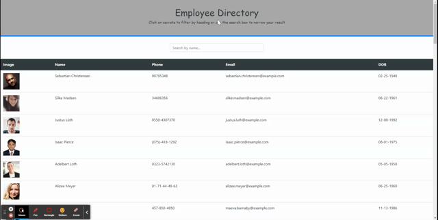

# EMPLOYEE DIRECTORY
This web application allows the user to see a random employee directory. For every employee we have the profile picture, name, phone number, email and date of birth.
The user can filter the employee list by name and sort them by name, phone number, email and date of birth.

The following image demonstrates the application functionality:

## Deployed link

[WeatherDashboard](https://employee-directory.herokuapp.com/)

## API Info
[Random User API](https://randomuser.me/)  is used to retrieve a list of employees randomly.

## Prerequisites
This software can be used on :
* Google Chrome
* Microsoft Edge   
* Firefox
 It hasn't been tested on other browsers but it might works properly.  

## Author

* [@carlastjuste](http://github.com/carlastjuste)

## License
This project is licensed under the MIT License - see the LICENSE.md file for details

- - -
© 2021 Carla ST JUSTE, All Rights Reserved.
